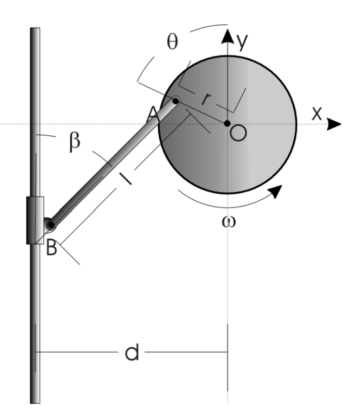

# 🚂 Locomotive Crank Shaft – Experimental Modeling & Simulation

  

## ✨ Overview
This was a collaborative lab project for our Dynamics & Controls course (ASEN 2803), where we modeled and analyzed the motion of a **locomotive crank shaft** mechanism. The system consists of a rotating disk connected to a sliding collar via a bar, converting rotational motion into vertical motion. We derived kinematic equations for the system and built a mathematical model to simulate the collar’s motion using MATLAB.

The model was validated by comparing simulated results with experimental data captured from physical sensors (rotary encoder and linear potentiometer). Through this lab, we explored how simplifying assumptions (e.g., constant angular velocity) compare to real-world behavior where noise, friction, and gravity are present.

---

## 👨‍💻 Personal Contributions

- **📋 Procedure & Experiment Setup**
  - Wrote and described the **experimental setup and measurement process**, including sensor functionality, voltage source configuration, and initial system calibration.
  - Detailed the process for collecting clean data using NI myDAQ and LabVIEW.
  - Explained how the linear potentiometer and rotary encoder converted real-world measurements into digital data for MATLAB analysis.

- **📉 Results Interpretation & Conclusion**
  - Wrote the **lab conclusion section**, analyzing error sources like sensor noise, human measurement discrepancies, and unmodeled physical effects such as gravity and friction.
  - Provided insights into why the model slightly underestimated actual collar velocity and recommended experimental and modeling improvements.

---

## 🛠 Tools & Technologies

- **MATLAB** – Used for building the mathematical model, importing data, comparing plots, and analyzing residuals.
- **LCSMODEL.m** – MATLAB function modeling the collar’s velocity based on system geometry and angular velocity.
- **LCSDATA.m** – MATLAB function to clean and preprocess experimental data from the rotary encoder and potentiometer.
- **NI myDAQ** – Used to capture voltage and angular position/velocity from the physical crankshaft system.
- **Rotary Encoder & Linear Potentiometer** – Sensors used to measure disk angle and collar position respectively.

---

## 📊 Results & Analysis

- **Error Analysis**:
  - The model slightly **underestimated collar velocity**, with increasing variability at higher voltages.
  - Mean error ranged from -0.005 to -0.072 m/s.
  - Errors were attributed to:
    - ±0.5 cm discrepancies in r, d, and l values
    - Non-constant angular velocity (especially at low voltages)
    - Unaccounted friction and gravitational influence
    - Sensor noise in real-time data

- **Residuals Plots**:
  - Generated side-by-side comparisons of modeled vs. experimental velocity.
  - Created residual plots (signed and absolute) across time and angle.
  - Showed how ideal assumptions deviate under real-world conditions.

---

## 📬 Contact
Reach out at dawi5869@colorado.edu
